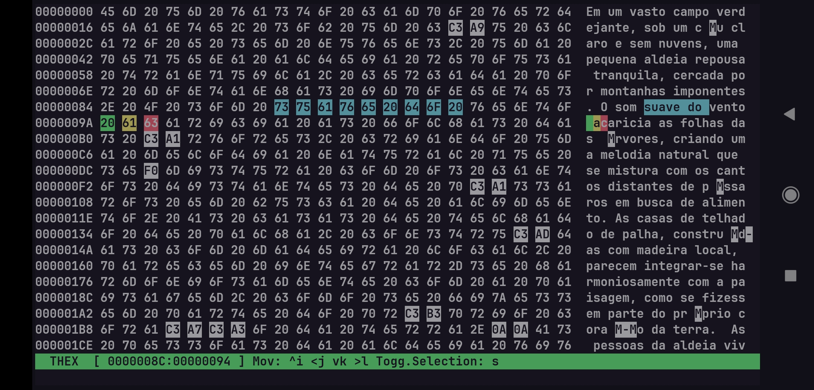
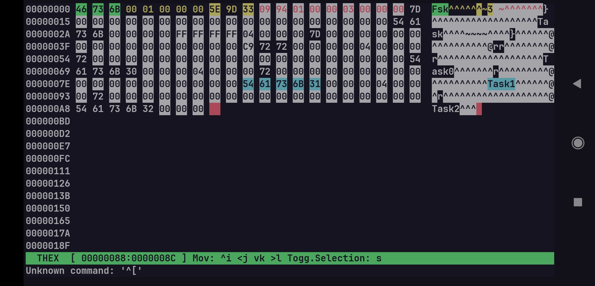

<p align="center">
    
</p>

<h1 align="center"><b>THex</b></h1>

<p align="center">
    <a href="./README.md"></a>
    <a href="./README.pt-br.md"></a>
</p>

THex is a powerful binary editing tool designed for the **terminal**. 
It features a vim-like interface, and offers a variety of useful tools, such as markers, data preview, and string insertion.

<div align="center">
    
    
</div>

## Features

- [x] Responsive Layout  
- [x] Ascii preview
- [x] Nibble to nibble edition 
- [x] Vim-like command line
- [x] Adicionar marcadores
- [ ] Preview for strings, numbers, flags, etc
- [ ] Swap files for store markers
- [ ] Custom language for data processing schemas 

## Build

First of all, clone this repository to your local machine:
```bash
git clone https://github.com/Raffa064/thex && cd thex
```

Before compiling the project, ensure that the compiler, cmake and ncurses library are installed:
```bash
$ sudo apt install clang libncuses-dev cmake
```

After done, execute `cmake` to generate configurations files: 
```bash
$ cmake .
```

> [!TIP]
This command should be called every time you add or remove files frfom `src` or `include` directories, or when changing `CMakeLists.txt` file.

**Build options**
- `-DDEBUG`: Disable compiler optimizaztions, to build faster; and enables warnigs and `gdb` debug.

The next step is to run cmake build command, to compile and generate our executable:
```bash
$ cmake --build .
```

Alright, now it's ready to be executed as follows:

```bash
$ ./thex test.bin
```

> [!IMPORTANT]
The THex editor was created and tested only on an android device (Termux environment), with clang-19, which is similar (not equivalent) to a Debian environment. 
So, if you encounter any issue while building at your device, open an [issue](https://github.com/Raffa064/thex/issues) describing the problem.

## Contributing

If you want to contribute to the project, read the [contributing guide](./CONTRIBUTING.md). Thanks you for considering supporting the project!

## License

This project is under the MIT License. See the [LICENSE](./LICENSE) file for details.

THex has the [ncurses](https://invisible-island.net/ncurses/) library as a dependency, licensed under the [GNU General Public License (GPL)](https://www.gnu.org/licenses/gpl.html). The use of this library does not change the license of this software, but its terms must be respected.
