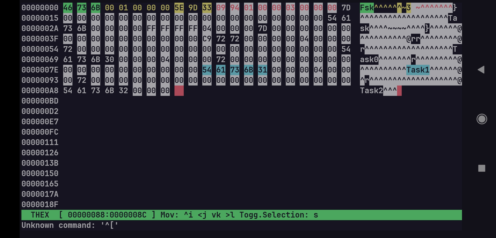

<p align="center">
    
</p>

<h1 align="center"><b>THex</b></h1>

<p align="center">
    <a href="./README.md"></a>
    <a href="./README.pt-br.md"></a>
</p>

O THex é uma poderosa ferramenta de edição para arquivos binários no **terminal**. Ele conta com uma interface que mimetiza editores vim-like, com diversas ferramentas úteis, como preview de dados, marcadores, insercão de strings etc. 

<div align="center">
    
    
</div>


## Features

- [x] Layout responsivo 
- [x] Ascii preview
- [x] Edição nibble a nibble 
- [x] Linha de commando, vim-like
- [x] Adicionar marcadores
- [ ] Preview de strings, números, flags, etc
- [ ] Swap files para marcadores e +
- [ ] Linguagem própria para esquemas e processamento de dados

## Instalação

Se você estiver usando um dispositivo **Linux** você pode baixar uma versão executavel diretamente da aba [actions](https://githuhb.com/Raffa064/thex/actions).

Caso estiver em outras plataformas, como **Android** (com Termux), será necessário fazer (compilar apartir do código fonte)[#build].

**Plataformas Suportadas**  
- [x] **Linux**: Instale diretamente pelo gerenciador de pacotes ou compile a partir do código fonte.  
- [x] **Android (Termux)**: Compile a partir do código fonte.  
- [x] **MacOS**: Não oficialmente testado, mas pode funcionar se compilado a partir do código fonte.  
- [ ] **Windows**: Não oficialmente suportado. Para compilar a partir do código fonte, são necessárias mudanças significativas, como trocar de **ncurses** para **PDCurses** e ajustar as configurações do compilador.

## Build

Para gerar uma build, primeiro, clone o repositorio usando git:
```bash
git clone https://github.com/Raffa064/thex && cd thex
```

Antes de compilar o projeto, certifique-se de que o compilador, cmake e a biblioteca ncurses estejam instalados:
```bash
$ sudo apt install clang libncuses-dev cmake
```

Após isso, é necessário executar o `cmake`, para que ele gere os arquivos de configuração:
```bash
$ cmake .
```

> [!TIP]
Esse comando deve ser executado sempre que adicionar e remover arquivos das pastas src e include, ou quando alterar algo no CMakeLists.txt.

**Opções de build:**
- `-DDEBUG`: Desabilita otimizações do compilador, para gerar build mais rápido; ativa warnings e habilita debug com gdb.
- `-OPTIMIZE`: Habilita várias otimizações do compilador e do linker. Não poded ser usado com `DEBUG` ativo.

Após isso, use o seguinte comando para gerar o executável:
```bash
$ cmake --build .
```

Pronto, agora é so utilizar:
```bash
$ ./thex test.bin
```

> [!IMPORTANT]
O THex foi criado e testado  apenas usando o clang-19 pelo Termux (no android),  ou seja, num ambiente mínimo derivado (não equivalente) do Debian.
Caso encontre algum problema ao gerar a build ou durante a execução, por favor, abra uma [issue](https://github.com/Raffa064/thex/issues) descrevendo o problema.

## Contribuição

Caso queira contribuir com o projeto, leia o [guia de contribuição](./CONTRIBUTING.pt-br.md). Obrigado por considerar suportar o projeto!

## Licença

Este projeto está licenciado sob a licença MIT. Veja o arquivo [LICENSE](./LICENSE) para mais detalhes.

O THex possui como a biblioteca [ncurses](https://invisible-island.net/ncurses/) como dependência, licenciada sob a [GNU General Public License (GPL)](https://www.gnu.org/licenses/gpl.html).  O uso desta biblioteca não altera a licença deste software, mas respeita os termos de sua licença.
